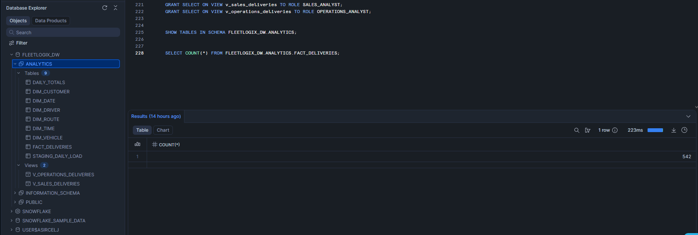

# Avance 3 - FleetLogix: Data Warehouse y Pipeline ETL

## Contexto
Con la base operacional poblada y las queries SQL optimizadas, este avance da el salto 
de un modelo OLTP a un modelo analítico. Se diseña e implementa un Data Warehouse en 
Snowflake con modelo estrella, y se construye un pipeline ETL automatizado que extrae 
datos de PostgreSQL, los transforma calculando métricas clave, y los carga en Snowflake 
de forma programada.

---

## Modelo Estrella

El modelo dimensional de FleetLogix se organiza en torno a una tabla central de hechos 
y 6 dimensiones de contexto.

### Tabla de Hechos: `fact_deliveries`
Cada fila representa una entrega completada. Contiene las métricas clave del negocio:
- `delivery_time_minutes` — tiempo total de entrega
- `delay_minutes` — minutos de retraso sobre lo programado
- `fuel_consumed_liters` — combustible usado en el viaje
- `distance_km` — kilómetros recorridos
- `cost_per_delivery` — costo estimado por entrega
- `revenue_per_delivery` — ingreso estimado por entrega
- `deliveries_per_hour` — productividad del conductor
- `fuel_efficiency_km_per_liter` — eficiencia del vehículo

### Dimensiones
- `dim_date` — calendario completo con días laborables, festivos, trimestres
- `dim_time` — horas del día para análisis por turnos
- `dim_vehicle` — información detallada de cada vehículo con historial (SCD Tipo 2)
- `dim_driver` — datos y desempeño de conductores con historial (SCD Tipo 2)
- `dim_route` — detalles de rutas y geografía
- `dim_customer` — información de clientes

### Decisiones de diseño
Se eligió el esquema estrella sobre el copo de nieve porque prioriza la velocidad 
de consulta sobre la normalización — ideal para dashboards y reportes analíticos. 
Se implementó SCD Tipo 2 en `dim_driver` y `dim_vehicle` para mantener trazabilidad 
histórica cuando un conductor cambia de estado o un vehículo cambia de tipo.

---

## Implementación en Snowflake

### Configuración
- **Warehouse:** `FLEETLOGIX_WH` (X-Small, auto-suspend 5 min)
- **Database:** `FLEETLOGIX_DW`
- **Schema:** `ANALYTICS`
- **Time Travel:** 30 días habilitado en todas las tablas
- **Vistas seguras:** `v_sales_deliveries` (solo datos de ventas) y `v_operations_delivables` (vista completa)

### Tablas creadas en Snowflake

```python
# Verificar tablas creadas en Snowflake
import snowflake.connector
from dotenv import load_dotenv
import os

load_dotenv()

conn = snowflake.connector.connect(
    user=os.getenv('SNOWFLAKE_USER'),
    password=os.getenv('SNOWFLAKE_PASSWORD'),
    account=os.getenv('SNOWFLAKE_ACCOUNT'),
    warehouse=os.getenv('SNOWFLAKE_WAREHOUSE'),
    database=os.getenv('SNOWFLAKE_DATABASE'),
    schema=os.getenv('SNOWFLAKE_SCHEMA')
)

cursor = conn.cursor()
cursor.execute("SHOW TABLES IN SCHEMA FLEETLOGIX_DW.ANALYTICS")
tables = cursor.fetchall()

print("TABLAS EN SNOWFLAKE - FLEETLOGIX_DW.ANALYTICS")
print("="*45)
for table in tables:
    print(f"  {table[1]}")

cursor.close()
conn.close()
```

---

## Pipeline ETL Automatizado

### Flujo del pipeline
El pipeline sigue el patrón ETL clásico ejecutado diariamente a las 2:00 AM:

**Extracción:** Conecta a PostgreSQL y extrae las entregas completadas del día anterior 
mediante un JOIN entre `deliveries`, `trips` y `routes`.

**Transformación:** Calcula métricas derivadas como tiempo de entrega, retrasos, 
eficiencia de combustible y costo por entrega. Aplica validaciones de calidad 
(no permite tiempos negativos ni pesos fuera de rango) e implementa SCD Tipo 2 
para manejar cambios históricos en conductores y vehículos.

**Carga:** Inserta los registros transformados en `fact_deliveries` y actualiza 
las dimensiones en Snowflake. Pre-calcula totales diarios en `daily_totals` 
para acelerar reportes recurrentes.

### Automatización
El pipeline usa la librería `schedule` para ejecutarse automáticamente cada día 
a las 2:00 AM sin intervención manual.

### Validación de datos cargados

```python
# Verificar datos cargados en Snowflake
import snowflake.connector
from dotenv import load_dotenv
import os

load_dotenv()

conn = snowflake.connector.connect(
    user=os.getenv('SNOWFLAKE_USER'),
    password=os.getenv('SNOWFLAKE_PASSWORD'),
    account=os.getenv('SNOWFLAKE_ACCOUNT'),
    warehouse=os.getenv('SNOWFLAKE_WAREHOUSE'),
    database=os.getenv('SNOWFLAKE_DATABASE'),
    schema=os.getenv('SNOWFLAKE_SCHEMA')
)

cursor = conn.cursor()

cursor.execute("SELECT COUNT(*) FROM fact_deliveries")
count = cursor.fetchone()[0]
print(f"Registros en fact_deliveries: {count:,}")

cursor.execute("SELECT COUNT(*) FROM daily_totals")
count_totals = cursor.fetchone()[0]
print(f"Registros en daily_totals: {count_totals:,}")

cursor.close()
conn.close()
```

---

## Conclusiones del Avance 3

Se implementó exitosamente el Data Warehouse de FleetLogix en Snowflake con modelo 
estrella compuesto por 1 tabla de hechos y 6 dimensiones. El pipeline ETL automatizado 
conecta PostgreSQL con Snowflake, transformando datos operacionales en información 
analítica con métricas calculadas como eficiencia de combustible, costo por entrega 
y productividad por conductor.

**Decisiones clave:**
- Esquema estrella para maximizar velocidad de consulta analítica
- SCD Tipo 2 en dimensiones de conductores y vehículos para trazabilidad histórica
- Pre-cálculo de totales diarios para acelerar dashboards ejecutivos
- Automatización con `schedule` para carga nocturna sin intervención manual

**Validaciones implementadas:**
- No se permiten tiempos de entrega negativos
- Pesos de paquetes dentro de rango válido (0-10.000 kg)
- Control de errores en cada etapa del pipeline con logging detallado


## Evidencia - Snowflake

