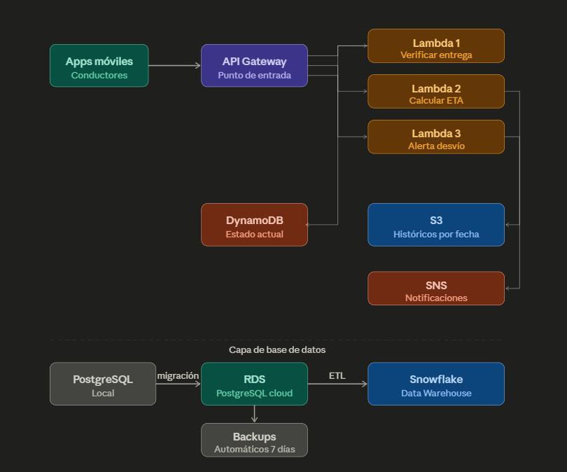

# Avance 4 - FleetLogix: Arquitectura Cloud AWS

## Contexto
FleetLogix necesita llevar su operación a la nube para procesar datos de la flota 
en tiempo real. Este avance diseña una arquitectura serverless en AWS que permite 
recibir datos de las apps móviles de los conductores, procesarlos con funciones Lambda, 
almacenarlos en múltiples capas según su naturaleza, y migrar la base PostgreSQL local 
a la nube.

---

## Diagrama de Arquitectura



El flujo de datos se divide en dos capas:

**Capa de procesamiento en tiempo real:**
Apps móviles → API Gateway → Lambda Functions → DynamoDB / S3 / SNS

**Capa de base de datos:**
PostgreSQL local → RDS (migración) → ETL → Snowflake

---

## Justificación Técnica de Servicios

### API Gateway
Punto de entrada único para las apps móviles de los conductores. La alternativa 
sería un servidor EC2 corriendo permanentemente, pero API Gateway cobra solo por 
request — ideal para una flota con tráfico variable. Maneja autenticación, 
throttling y routing sin código adicional. Expone 3 rutas:
- `POST /deliveries/verify` → Lambda 1
- `GET /eta` → Lambda 2
- `POST /alerts/deviation` → Lambda 3

### AWS Lambda
Las 3 funciones son operaciones cortas y puntuales que se ejecutan en milisegundos. 
Lambda cobra solo por ejecución — EC2 cobraría aunque no haya tráfico. Para una 
flota de 200 vehículos con operación diaria, Lambda es significativamente más 
económico y no requiere administración de servidores.

### DynamoDB
El estado actual de las entregas cambia constantemente y necesita lectura/escritura 
en milisegundos. DynamoDB es NoSQL optimizado para acceso por clave primaria con 
latencia de un dígito en milisegundos. RDS sería inadecuado aquí porque está 
optimizado para consultas complejas con JOINs, no para escrituras de alta frecuencia 
en tiempo real.

### Amazon S3
Almacenamiento infinito y económico organizado por fecha (`raw-data/YYYY/MM/DD/`). 
Los datos se archivan automáticamente a Glacier después de 90 días reduciendo costos. 
Alternativa sería guardar todo en RDS pero se vuelve costoso y lento a escala de 
millones de registros históricos.

### AWS RDS (PostgreSQL)
Migración de la base PostgreSQL local a la nube manteniendo toda la funcionalidad 
relacional. RDS se encarga automáticamente de backups, parches, alta disponibilidad 
y escalado. Retención de backups configurada en 7 días con ventana de mantenimiento 
dominical.

### SNS (Simple Notification Service)
Pub/Sub serverless para alertas de desvío de ruta. Cuando Lambda 3 detecta un 
desvío, publica en SNS que notifica simultáneamente a múltiples destinos (email, 
SMS, otra Lambda). Desacopla el emisor del receptor — si se necesita agregar un 
nuevo destino de notificación, no se modifica Lambda 3.

---

## Funciones Lambda

### Lambda 1 — Verificar entrega completada
Consulta DynamoDB con el `delivery_id` y verifica si el estado es `delivered`. 
Retorna el estado actual, número de tracking y fecha de entrega.

```python
def lambda_verificar_entrega(event, context):
    delivery_id = event.get('delivery_id')
    table = dynamodb.Table('deliveries_status')
    response = table.get_item(Key={'delivery_id': delivery_id})
    
    if 'Item' in response:
        item = response['Item']
        return {
            'statusCode': 200,
            'body': {
                'delivery_id': delivery_id,
                'is_completed': item.get('status') == 'delivered',
                'status': item.get('status'),
                'delivered_datetime': str(item.get('delivered_datetime', ''))
            }
        }
```

### Lambda 2 — Calcular tiempo estimado de llegada (ETA)
Recibe la ubicación actual del vehículo y el destino. Calcula la distancia 
usando la fórmula de Haversine simplificada y estima el tiempo en base a la 
velocidad actual. Guarda el tracking en DynamoDB.

```python
def lambda_calcular_eta(event, context):
    vehicle_id = event.get('vehicle_id')
    current_location = event.get('current_location')
    destination = event.get('destination')
    current_speed_kmh = event.get('current_speed_kmh', 60)
    
    lat_diff = abs(destination['lat'] - current_location['lat'])
    lon_diff = abs(destination['lon'] - current_location['lon'])
    distance_km = ((lat_diff ** 2 + lon_diff ** 2) ** 0.5) * 111
    
    hours = distance_km / current_speed_kmh
    eta = datetime.now() + timedelta(hours=hours)
    
    return {
        'statusCode': 200,
        'body': {
            'distance_remaining_km': round(distance_km, 2),
            'eta': eta.isoformat(),
            'estimated_minutes': round(hours * 60)
        }
    }
```

### Lambda 3 — Alerta por desvío de ruta
Compara la ubicación actual del vehículo con los waypoints de la ruta esperada. 
Si la distancia mínima a cualquier waypoint supera 5 km, publica una alerta en 
SNS y guarda el registro en DynamoDB.

```python
def lambda_alerta_desvio(event, context):
    vehicle_id = event.get('vehicle_id')
    current_location = event.get('current_location')
    route_id = event.get('route_id')
    
    # Obtener waypoints de DynamoDB
    waypoints = get_route_waypoints(route_id)
    
    # Calcular distancia mínima a la ruta
    min_distance = min(
        calculate_distance(wp, current_location) 
        for wp in waypoints
    )
    
    DEVIATION_THRESHOLD_KM = 5
    if min_distance > DEVIATION_THRESHOLD_KM:
        sns.publish(
            TopicArn='arn:aws:sns:us-east-1:...:fleetlogix-alerts',
            Message=json.dumps({
                'vehicle_id': vehicle_id,
                'deviation_km': round(min_distance, 2),
                'alert_type': 'ROUTE_DEVIATION'
            })
        )
```

---

## Tablas DynamoDB

| Tabla | Clave primaria | Uso |
|---|---|---|
| `deliveries_status` | `delivery_id` | Estado actual de cada entrega |
| `vehicle_tracking` | `vehicle_id` + `timestamp` | Historial de ubicaciones GPS |
| `routes_waypoints` | `route_id` | Puntos de control de cada ruta |
| `alerts_history` | `vehicle_id` + `timestamp` | Historial de alertas generadas |

---

## Configuración de Backups

- **RDS:** Backups automáticos diarios con retención de 7 días
- **Ventana de backup:** 03:00-04:00 UTC
- **Ventana de mantenimiento:** Domingos 04:00-05:00 UTC
- **S3:** Lifecycle policy — datos a Glacier después de 90 días
- **Snapshot manual inicial:** Generado antes de cada migración importante

---

## Dashboard CloudWatch — 5 Métricas y 2 Alertas

### Métricas monitoreadas
1. **Entregas completadas por hora** — volumen operativo en tiempo real
2. **Latencia promedio de Lambda** — performance del sistema
3. **Errores de Lambda (tasa)** — detección temprana de fallas
4. **Conexiones activas a RDS** — salud de la base de datos
5. **Desvíos de ruta detectados por día** — indicador operativo de la flota

### Alertas configuradas
1. **Alerta crítica:** Tasa de errores Lambda > 5% en 5 minutos → notificación SNS al equipo técnico
2. **Alerta operativa:** Más de 10 desvíos de ruta en 1 hora → notificación al supervisor de operaciones

---

## Costos Teóricos Estimados (mensual)

| Servicio | Uso estimado | Costo aprox. |
|---|---|---|
| API Gateway | 500.000 requests/mes | ~$1.75 |
| Lambda | 1.5M invocaciones × 200ms | ~$0.50 |
| DynamoDB | 5GB almacenamiento + 1M lecturas | ~$3.00 |
| S3 | 50GB datos históricos | ~$1.15 |
| RDS (db.t3.micro) | 730 horas/mes | ~$15.00 |
| SNS | 100.000 notificaciones | ~$0.10 |
| CloudWatch | Métricas básicas | ~$3.00 |
| **Total estimado** | | **~$24.50/mes** |

*Nota: Costos calculados con precios de AWS us-east-1 (abril 2026). 
El tier gratuito de AWS cubre gran parte de este uso en el primer año.*

---

## Conclusiones del Avance 4

Se diseñó una arquitectura serverless en AWS que permite a FleetLogix procesar 
datos de la flota en tiempo real con un costo estimado de $24.50/mes. La 
arquitectura separa claramente las responsabilidades: API Gateway para recepción, 
Lambda para procesamiento, DynamoDB para estado actual, S3 para históricos y 
RDS para datos relacionales.

**Decisiones clave:**
- Serverless (Lambda + API Gateway) sobre EC2 para reducir costos operativos
- DynamoDB para estado en tiempo real, RDS para consultas relacionales complejas
- SNS desacopla la generación de alertas de su distribución
- S3 con Glacier para almacenamiento histórico económico a largo plazo

**Flujo completo de datos FleetLogix:**
PostgreSQL → RDS → ETL Python → Snowflake (análisis histórico)
Apps móviles → API Gateway → Lambda → DynamoDB (tiempo real)
